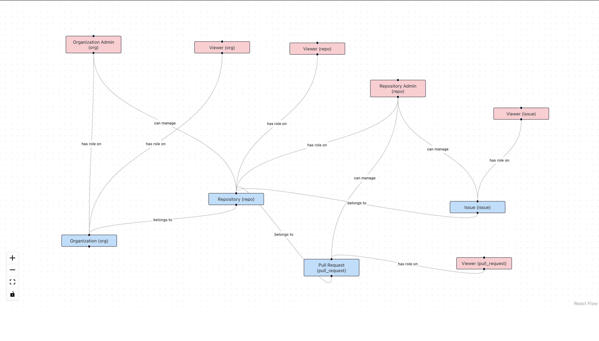

# Project Title

## Overview
This project consists of a Flask backend and a React frontend that visualizes resource relationships and roles using a graph representation of Github. The backend fetches data from the Permit API, and the frontend renders this data in a 3D graph.

## Setup

### Backend Setup
1. Navigate to the backend directory:
    ```bash
    cd backend
    ```

2. Create a virtual environment (optional but recommended):
    ```bash
    python -m venv venv
    ```

3. Activate the virtual environment:

   - On macOS/Linux:
     ```bash
     source env/bin/activate
     ```

4. Install the required packages:
    ```bash
    pip install flask flask-cors python-dotenv requests
    ```

5. Create a `.env` file in the backend directory with your Permit API key:
    ```plaintext
    PERMIT_API_KEY=your_api_key_here
    ```
   Replace `your_api_key_here` with your actual Permit API key.

6. Run the Flask app:
    ```bash
    python3 app.py
    ```
   The backend server will start at `http://127.0.0.1:5000`.

### Frontend Setup
1. Navigate to the frontend directory:
    ```bash
    cd frontend
    ```

2. Install the required npm packages:
    ```bash
    npm install
    ```

3. Start the React app:
    ```bash
    npm start
    ```
   The frontend application will open in your default web browser at `http://localhost:3000`.

## Images

Here are the visual representations and screenshots related to the project using ReactFlow

### Graph Visualization 1


### Graph Visualization 2



### API JSON Response Visualization


## Usage
The React app will fetch data from the Flask backend and visualize it as a graph. Click on the nodes in the graph to see their labels.

## Troubleshooting
- If you encounter any issues with CORS, ensure that your Flask server is running and CORS is enabled for all routes.
- Check your API key in the `.env` file to make sure it is correct.

## License
This project is licensed under the MIT License - see the LICENSE file for details.

## Acknowledgments
- Permit.io for providing the API.
